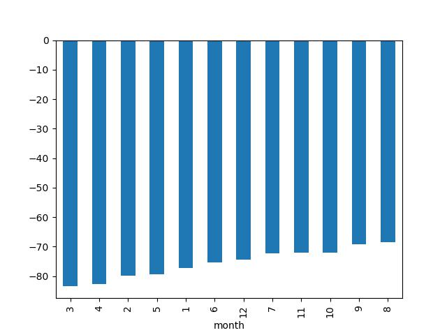
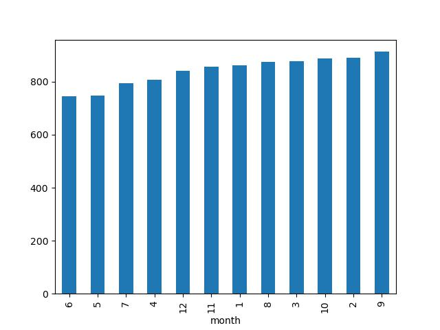
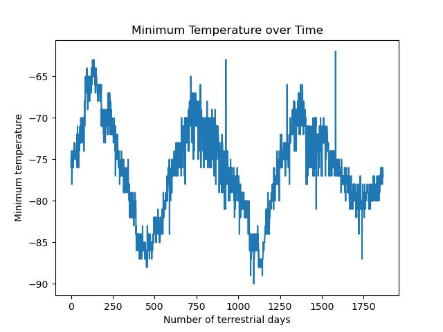

## Intergalactic Data Retrieval

Mission Brief: Intergalactic Data Retrieval and Analysis 🚀

Congratulations, Cadet! You've been selected by the Intergalactic Space Agency for a top-secret mission. As a data explorer, your mission is to travel across the digital galaxy, collect hidden data from alien web systems, and bring it back to base for analysis.

You’ve already mastered the tools of the trade—navigating the unknown with Splinter to automate your space rover and using Beautiful Soup to decipher mysterious HTML signals. Along the way, you’ll gather intelligence from interplanetary databases, whether they’re HTML tables, alien news networks, or recurring data patterns sent from far-off worlds.

This mission is about honing your explorer’s skills: extracting extraterrestrial data, organizing and storing findings in our space station, analyzing these cosmic insights, and then communicating your discoveries with powerful visualizations back at HQ.

Prepare to launch, Data Explorer! Your mission awaits in the stars.

## Table of Contents

- [Mars Data Challenge Overview](#mars-data-challenge-overview)
- [Challenge Files](#challenge-files)
- [Data Visualizations](#data-visualizations)
- [Insights](#insights)

## Challenge Files

The project includes the following files:

1. `Charts` - Contains folder with collection of weather analysis charts. (e.g., avg_temp, avg_pressure).
2. `part_1_mars_news` - Contains scraped information of mars news articles. (e.g., title, preview).
3. `part_2_mars_weather` - Contains scarped information of martian weather data and analysis. 

## Data Visualizations

1. Average minimum temperature by month in a Martian Year.

2. Average pressure by month in a Martian Year.

3. Minimum temperature of Mars over a terrestrial earth year.

## Insights

By judging temperature cycles of Mars we can visually approximate that the Martian year is approximately 600 earth years. 

